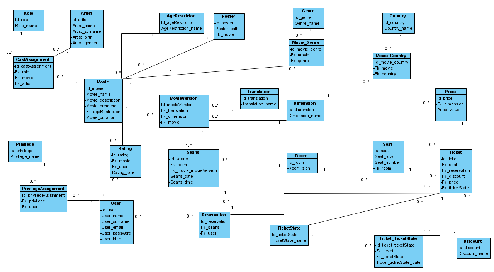

# PROJEKT RELACYJNEJ BAZY DANYCH - PROJECT OF THE RELATIVE DATABASE
Kamila Sproska, Michał Gadziński, Dominik Stachowiak

This project contains all the steps undertaken to crate a relative database for a singular cinema facility.
For the purposes of this exercise database was filled with random data, so that further processes (like creating queries)
would return validatable data.

## [Planning](P0_planning)
First draft of a database. File [multikino_database.vpp](P0_planning/multikino_database.vpp) contains class diagram, as presented below:


### Zajęcia 1 - Faza konceptualna
#### Potrzeby informacyjne:
- Tytuły filmów będących obecnie w kinie
- Repertuar na dany dzień
- Dostępność miejsc dla danego seansu
- Daty premier filmów
- Cennik i zniżki
- Informacje o tytule (np opis, reżyseria...)
- Numer sali w której ma się odbywać seans (po zakupie biletu)
- Jakie są opcje rezerwacji x miejsc koło siebie na danym seansie
#### Jakie wyszukania można wykonać:
- Jakie seanse są dostępne danego dnia (opcjonalnie po danej godzinie)
- Wyszukanie wszystkich dostępnych seansów dla danego tytułu
- Tytuły wszystkich filmów z nieodbytymi premierami
- Tytuły wszystkich filmów z gatunku
- Tytuły filmów w danym typie tłumaczenia (napisy, lektor, dubbing, oryginał)
- Tytuły po typie seansu (2d, 3d)

## [Initializing database](P1_initializing_database)
- File [f1_creating_empty_tables](P1_initializing_database/f1_creating_empty_tables.sql) creates tables in SQL DDL 
according to the draft.

All entities after normalization:
```
AgeRestriction      (Id_ageRestriction, AgeRestriction_name)
Artist	            (Id_artnist, Artist_name, Artist_surname, Artist_birth, Artist_gender)
CastAssignment	    (Id_castAssignment, Fk_artist, Fk_movie,  Fk_role)
Country	            (Id_country, Country_name)
Dimension           (Id_dimension, Dimension_name)
Discount            (Id_discount, Discount_name)
Genre	            (Id_genre, Genre_name)
Movie	            (Id_movie, Movie_name, Movie_description, Movie_premiere, Movie_duration, Fk_ageRestriction)
MovieVersion	    (Id_movie_version, Fk_seans, Fk_translation, Fk_dimension)
Movie_Country	    (Id_movie_country, Fk_movie, Fk_country)
Movie_Genre         (Id_movie_genre, Fk_movie, Fk_genre)
Movie_MovieVersion  (Id_movie_movieVersion, Fk_movie, Fk_movieVersion)
Poster	            (Id_poster, Poster_path, Fk_movie)
Price	            (Id_price, Fk_dimention, Fk_discount, Price_value)
Privilege           (Id_privilege, Privilege_name)
PrivilegeAssignment (Id_privilegeAssignment, Fk_privilege, Fk_user)
Rating              (Id_rating, Fk_Movie, Fk_User, Rating_rate)
Reservation         (Id_reservation, Fk_seans, Fk_reservationState, Fk_user)
ReservationState    (Id_reservationState, ReservationState_name)
Role	            (Id_role, Role_name)
Room	            (Id_room, Room_sign)
Seans	            (Id_seans, Fk_room, Fk_movieVersion, Seans_date, Seans_time)
Seat	            (Id_seat, Seat_row, Seat_number, Fk_room)
Ticket	            (Id_ticket, Fk_seat, Fk_reservation, Fk_discount, Fk_Price)
Translation         (Id_translation, Translation_name)
User	            (Id_user, User_name, User_surname, User_email, User_password, User_birth)
```

- File [f4_adding_objects_to_database](P1_initializing_database/f4_adding_objects_to_database.py) 
fills database with objects generated in [f3_creating_all_objects](P1_initializing_database/f3_creating_all_objects.py).

- File [f2_3_tables_as_classes](P1_initializing_database/f2_3_tables_as_classes.py) contains classes with attributes 
with the same names and in the same order as they are implemented in [SQL DDL](P1_initializing_database/f1_creating_empty_tables.sql).

ex.
```sql
CREATE TABLE TicketState (
    Id_ticketState int not null auto_increment,
    TicketState_name varchar(255),
    PRIMARY KEY (Id_ticketState)
);
```
```python
class TicketState(ObjectWithCounter, AddableToDatabase):
    def __init__(self, ticket_state_name: str):
        self.Id_ticketState: int = TicketState.next()
        self.TicketState_name: str = ticket_state_name
```

## [Queries & interfaces](P2_queries_and_interfaces)
- File [Interfejs](P2_queries_and_interfaces/Interfejs.pdf) contains a pdf version of the database interface created in Balsamiq.
- File [queries](P2_queries_and_interfaces/queries.sql) contains queries created according to the needs that came up 
while planing the interface. In the comment of each query there are numbers relating to the page number 
in the [interface file](P2_queries_and_interfaces/Interfejs.pdf).

## [Explain & indexes](P3_explain_and_indexes)
File [creating_indexes](P3_explain_and_indexes/creating_indexes.sql) contains the script creating Indexes for SQL tables according to the need stemming from the created [queries](P2_queries_and_interfaces/queries.sql).

## [Modification](P4_mod)
File [f1_creating_empty_tables](P4_mod/f1_creating_empty_tables.sql) creates tables in SQL DDL 
according to the **modified** draft.



## Other


